# API Dashboard Statistics - Postman

Tai lieu nay dung de test Postman cho phan **Dashboard** trong portal admin.

## Cau hinh chung

Base URL:

```http
http://localhost:8080/api
```

Headers:

```http
Authorization: Bearer <access_token>
Content-Type: application/json
```

Quyen: `ADMIN` hoac `MANAGER` deu goi duoc cac API duoi day.

## 1. Tong quan dashboard

API nay lay so lieu cho tab **Overview**.

```http
GET /manage/dashboard/overview/stats
```

Full URL Postman:

```http
GET http://localhost:8080/api/manage/dashboard/overview/stats
```

Response mau:

```json
{
  "totalUsers": 120,
  "userOnlines": 8,
  "totalRooms": 35,
  "totalSubscriptions": 18,
  "userDayGrowth": 5.2,
  "roomDayGrowth": 2.1,
  "subscriptionDayGrowth": 0.0,
  "onlineDayGrowth": 10.0,
  "userMonthGrowth": 20.5,
  "roomMonthGrowth": 15.0,
  "subscriptionMonthGrowth": 7.8
}
```

Y nghia:

| Field | Noi dung |
|---|---|
| `totalUsers` | Tong so user |
| `userOnlines` | So user dang online |
| `totalRooms` | Tong so room |
| `totalSubscriptions` | Tong subscription da thanh toan |
| `...DayGrowth` | Ti le tang/giam so voi hom qua |
| `...MonthGrowth` | Ti le tang/giam so voi thang truoc |

## 2. Bieu do tong quan

API nay lay du lieu ve bieu do line chart trong tab **Overview**.

```http
GET /manage/dashboard/overview/chart?period=WEEKLY
```

Full URL Postman:

```http
GET http://localhost:8080/api/manage/dashboard/overview/chart?period=WEEKLY
```

Gia tri `period`:

| period | Lay du lieu |
|---|---|
| `WEEKLY` | 7 ngay gan nhat |
| `MONTHLY` | 1 thang gan nhat |
| `QUARTERLY` | 3 thang gan nhat |
| `YEARLY` | 1 nam gan nhat |

Response mau:

```json
[
  {
    "date": "2026-06-23",
    "totalUser": 120,
    "totalRooms": 35,
    "totalSubscriptions": 18
  }
]
```

Note: du lieu chart lay tu bang `statistics`, bang nay duoc tao snapshot moi ngay.

## 3. Thong ke Users

API nay lay so lieu cho tab **Users** trong dashboard.

```http
GET /manage/dashboard/users/stats
```

Full URL Postman:

```http
GET http://localhost:8080/api/manage/dashboard/users/stats
```

Response mau:

```json
{
  "totalUsers": 120,
  "newUsersToday": 5,
  "newUsersThisMonth": 32,
  "activeUsers": 100,
  "inactiveUsers": 15,
  "bannedUsers": 5,
  "freeUsers": 80,
  "teamUsers": 30,
  "businessUsers": 10
}
```

Y nghia:

| Field | Noi dung |
|---|---|
| `totalUsers` | Tong user role `USER` |
| `newUsersToday` | User moi tao hom nay |
| `newUsersThisMonth` | User moi tao trong thang nay |
| `activeUsers` | User co status `ACTIVE` |
| `inactiveUsers` | User co status `INACTIVE` |
| `bannedUsers` | User co status `BANNED` |
| `freeUsers` | User goi `FREE` |
| `teamUsers` | User goi `TEAM` |
| `businessUsers` | User goi `BUSINESS` |

Giao dien hien tai chi hien:

- 4 card: Total users, New today, New this month, Active users
- 2 bang nho: Status va Plan

## 4. So do luong xu ly Users stats

```mermaid
flowchart LR
  A["Admin mo tab Users"] --> B["user-overview.vue"]
  B --> C["dashboardService.getUserStatsData()"]
  C --> D["GET /api/manage/dashboard/users/stats"]
  D --> E["StatisticsController.getUserStats()"]
  E --> F["StatisticsService.getUserStatsData()"]
  F --> G["UserRepository count..."]
  G --> H["Bang users"]
  H --> I["Tra JSON UserStatsResponse"]
  I --> J["Hien thi shadcn Card/Table"]
```



## 5. Loi hay gap

| Ma loi | Nguyen nhan |
|---:|---|
| `401` | Chua gui token hoac token het han |
| `403` | Token khong co quyen `ADMIN`/`MANAGER` |
| `400` | Sai `period`, vi du gui `week` thay vi `WEEKLY` |
| `404` | Sai URL, nho co `/api` o sau port |
