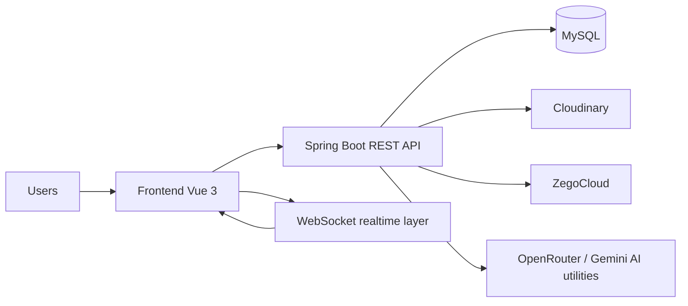

# Synkork Workspace

<p align="center">
  <strong>Personal repository for a realtime team collaboration platform with scheduling and AI-assisted workflows.</strong>
</p>

<p align="center">
  <a href="./README.md">Root</a>
  ·
  <a href="./README.vi.md">Tiếng Việt</a>
  ·
  <a href="./README.zh-CN.md">中文</a>
</p>

## 1. Overview

Synkork is a room-and-space based collaboration platform built for team communication and coordination. Conceptually, it sits between a Discord-style workspace and an office collaboration suite by combining:

- Realtime chat
- Group calling
- Shared notes
- Task management
- Shared calendar scheduling
- AI-assisted message and meeting workflows

This repository is my personal presentation and development branch derived from the broader team graduation project. Its purpose is to make the system easier to understand while clearly highlighting my implementation focus.

## 2. Repository Positioning

This is a personal technical repository, not just a mirror of the original team codebase.

It is intended to:

- present the full workspace architecture in a clearer way
- document the parts I focused on most
- support continued iteration on my own branch

My main ownership emphasis in this repository is:

- `calendar`
- `llm function`

## 3. High-Level Architecture



Core repository areas:

- `frontend/`: primary end-user application
- `backend/`: APIs, auth, realtime, collaboration modules
- `portal-admin/`: admin dashboard layer
- `database/`: data and schema support assets
- `llm/`: AI integration notes and calendar/LLM guidance

## 4. Technology Stack

### Backend

- Java 21
- Spring Boot 3.5.9
- Spring Security
- OAuth2 Client / Resource Server
- Spring Data JPA
- Spring WebSocket
- MySQL
- JWT
- Cloudinary
- Google OAuth2
- Google GenAI dependency and Gemini configuration

### Frontend

- Vue 3
- Vite
- TypeScript
- Pinia
- Tailwind CSS 4
- dayjs
- STOMP / socket-related realtime clients
- Zego WebRTC SDK

### Admin

- Vue 3
- Vite
- TypeScript
- shadcn-vue-based dashboard stack
- pnpm workflow

### AI

- OpenRouter-based chat completion flows
- Gemini key configuration present in backend settings for future extension

## 5. Calendar Module Highlights

The calendar module is implemented as a collaborative workspace feature rather than a simple date UI.

Current capabilities visible in the codebase:

- event CRUD by collaboration space
- month, week, and year views
- backend recurrence expansion
- overlap/conflict detection
- permission-aware editing
- realtime event synchronization via WebSocket topic broadcasting
- attendees and attachment-aware form structure
- chat-to-calendar draft handoff

### Calendar Flow

1. Users interact through `CalendarWindowLayout.vue`
2. `useCalendar()` coordinates date state, event operations, and realtime behavior
3. Frontend calls `calendarService.ts`
4. `CalendarEventController` exposes REST endpoints
5. `CalendarEventService` handles business logic
6. Persistence goes through `CalendarEventRepository`
7. Create/update/delete operations broadcast to `/topic/space/{spaceId}/calendar`
8. `useCalendarRealtime.ts` updates the local event list in-place

### Calendar Technical Decisions

- Recurring events are expanded on the backend for consistency across views
- Conflict detection runs against actual day-level occurrences, including recurring instances
- Edit permission stays intentionally simple:
  - creator can edit/delete
  - others can edit only when `allowEditAll` is enabled
- Realtime channels are scoped by space to keep synchronization localized

Key files:

- `backend/.../calendar/controller/CalendarEventController.java`
- `backend/.../calendar/service/CalendarEventService.java`
- `backend/.../calendar/dto/CalendarEventDTO.java`
- `frontend/src/components/windows/CalendarWindowLayout.vue`
- `frontend/src/components/calendar/composables/useCalendar.ts`
- `frontend/src/components/calendar/composables/useCalendarRealtime.ts`

## 6. LLM Function Highlights

The LLM-related work in this repository currently centers on two practical collaboration flows:

1. extracting event suggestions from Vietnamese chat content
2. transcribing and summarizing meeting voice input

### Chat to Calendar Suggestion Flow

1. A chat message can be analyzed by `llmService.detectEventFromMessage(...)`
2. The backend sends a structured prompt to OpenRouter
3. The model returns JSON for event detection
4. Frontend receives a suggestion payload
5. `calendarSuggestionStore.ts` temporarily bridges state between chat and calendar
6. `CalendarSuggestionChannelDialog.vue` lets the user choose the target calendar channel
7. `calendarSuggestion.ts` normalizes fallback date/time values
8. The calendar dialog opens with a ready-to-edit draft

### Voice Meeting Summary Flow

1. Voice input is uploaded to `/collaboration/voice-summary/upload`
2. `llmServiceVoice` uploads the file through `FileService`
3. `llmMeetingService.transcribeAudio(...)` converts audio into text
4. `llmMeetingService.summarizeMeeting(...)` returns structured Vietnamese JSON
5. Backend responds with:
   - file URL
   - public ID
   - transcript
   - summary analysis

### LLM Technical Decisions

- JSON output is used for both extraction and summary flows to simplify parsing and validation
- Audio transcription and summary are separated into distinct steps for easier debugging and reuse
- A lightweight frontend store decouples the chat UI from calendar creation flow

Key files:

- `backend/src/main/java/com/synkork/backend/common/utils/llmService.java`
- `backend/src/main/java/com/synkork/backend/common/utils/llmMeetingService.java`
- `backend/src/main/java/com/synkork/backend/common/utils/llmServiceVoice.java`
- `frontend/src/utils/calendarSuggestion.ts`
- `frontend/src/stores/calendarSuggestionStore.ts`
- `frontend/src/components/chat/sub-components/CalendarSuggestionChannelDialog.vue`

## 7. Local Setup

Requirements:

- Java 21
- Node.js 22+
- MySQL
- npm for `frontend`
- pnpm for `portal-admin`

### Backend

```bash
cd backend
./mvnw spring-boot:run
```

### Frontend

```bash
cd frontend
npm install
npm run dev
```

### Admin portal

```bash
cd portal-admin
pnpm install
pnpm dev
```

## 8. Environment Variables

Important backend-side variables reflected in the current code/config:

- `DB_URL`
- `DB_USERNAME`
- `DB_PASSWORD`
- `GOOGLE_CLIENT_ID`
- `GOOGLE_CLIENT_SECRET`
- `GMAIL_USERNAME`
- `GMAIL_PASSWORD`
- `CLOUDINARY_CLOUD_NAME`
- `CLOUDINARY_API_KEY`
- `CLOUDINARY_API_SECRET`
- `ZEGO_APPID`
- `ZEGO_SERVER_SECRET`
- `GEMINI_API_KEY`
- `OPENROUTER_API_KEY`
- `OPENROUTER_BASE_URL`
- `FRONTEND_URL`
- `ADMIN_PORTAL_URL`

Frontend-side examples:

- `VITE_SERVER_API_URL`
- `VITE_SERVER_API_PREFIX`
- `VITE_SERVER_API_TIMEOUT`

## 9. Forward Work

- complete full attendee and attachment persistence for calendar workflows
- harden validation boundaries around AI responses
- add more focused tests for recurrence and conflict handling
- continue documenting deployment and operational setup

## 10. Notes

- `portal-admin` still carries the lineage of a customized `shadcn-vue-admin` starter.
- The `gh` CLI was not authenticated in the current environment, so this documentation was written from source inspection rather than live GitHub metadata.
- This repository originates from a team project context, but the documentation is intentionally framed as a personal technical presentation branch.
