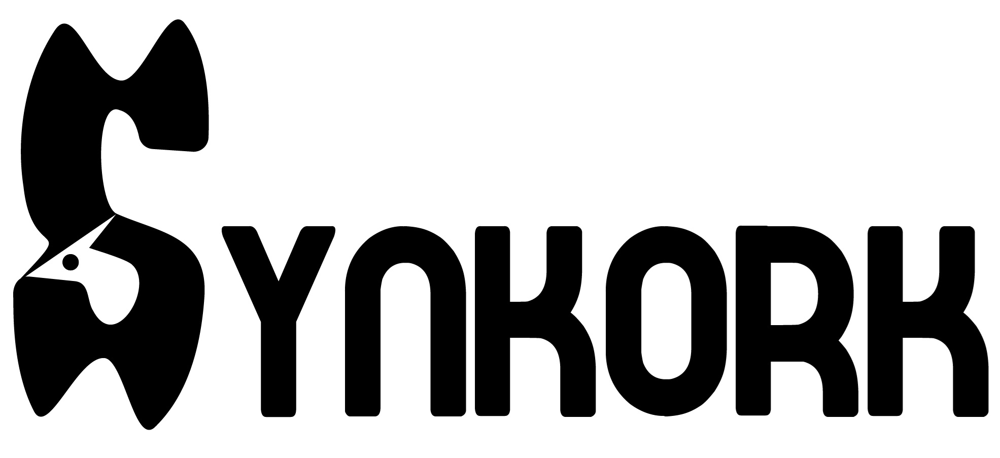
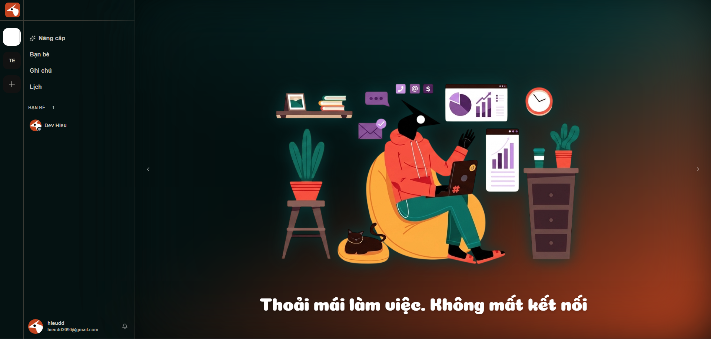

<!-- Improved compatibility of back to top link: See: https://github.com/DevHieu/Synkork/pull/73 -->
<a id="readme-top"></a>
<!--
*** Thanks for checking out the Best-README-Template. If you have a suggestion
*** that would make this better, please fork the repo and create a pull request
*** or simply open an issue with the tag "enhancement".
*** Don't forget to give the project a star!
*** Thanks again! Now go create something AMAZING! :D
-->


<!-- PROJECT SHIELDS -->
<!--
*** I'm using markdown "reference style" links for readability.
*** Reference links are enclosed in brackets [ ] instead of parentheses ( ).
*** See the bottom of this document for the declaration of the reference variables
*** for contributors-url, forks-url, etc. This is an optional, concise syntax you may use.
*** https://www.markdownguide.org/basic-syntax/#reference-style-links
-->

<!-- PROJECT LOGO -->
<br />
<div align="center">
  <a href="https://github.com/DevHieu/Synkork">
    
  </a>

  <h3 align="center">Synkork</h3>

  <p align="center">
    An Application for Effective Team Collaboration and Work Management
  </p>
  
  [![Contributors][contributors-shield]][contributors-url]
  [![Forks][forks-shield]][forks-url]
  [![Stargazers][stars-shield]][stars-url]
  [![Issues][issues-shield]][issues-url]
  [![Unlicense License][license-shield]][license-url]

  <p>
    <a href="https://synkork.id.vn">Website</a>
    &middot;
    <a href="#key-features">Key Features</a>
    &middot;
    <a href="#installation">Installation</a>
    &middot;
    <a href="https://github.com/DevHieu/Synkork/issues/new?labels=bug&template=bug-report---.md">Report Bug</a>
    &middot;
    <a href="https://github.com/DevHieu/Synkork/issues/new?labels=enhancement&template=feature-request---.md">Request Feature</a>
  </p>
</div>

<p align="center">
  
</p>

<!-- TABLE OF CONTENTS -->
<details>
  <summary>Table of Contents</summary>
  <ol>
    <li>
      <a href="#about-the-project">About The Project</a>
      <ul>
        <li><a href="#key-features">Key Features</a></li>
        <li><a href="#built-with">Built With</a></li>
      </ul>
    </li>
    <li>
      <a href="#getting-started">Getting Started</a>
      <ul>
        <li><a href="#prerequisites">Prerequisites</a></li>
        <li><a href="#installation">Installation</a></li>
      </ul>
    </li>
    <li><a href="#roadmap">Roadmap</a></li>
    <li><a href="#contributing">Contributing</a></li>
    <li><a href="#license">License</a></li>
    <li><a href="#contact">Contact</a></li>
    <li><a href="#acknowledgments">Acknowledgments</a></li>
  </ol>
</details>


<!-- ABOUT THE PROJECT -->
## About The Project

Synkork is a comprehensive collaboration and work management platform designed for teams and organizations. Taking inspiration from the fluid communication style of Discord, Synkork enhances team collaboration by seamlessly integrating professional productivity tools. Teams can chat in real-time, initiate high-quality video/audio calls, collaborate on notes/wikis, organize work using Kanban task boards, and coordinate events with a shared calendar—all within a single workspace.

### Key Features

* **Real-Time Chat Channels**: Create specific text channels for different topics within your workspace. Chat updates instantly using WebSockets.
* **Group Video & Voice Calls**: Initiate high-quality video or voice calls directly from within your space, powered by ZegoCloud.
* **Shared Team Calendar**: Schedule meetings, track deadlines, and sync team events in a centralized calendar.
* **Collaborative Workspace Notes**: Create shared wiki notes for documentation, featuring version tracking.
* **Kanban Boards & Task Management**: Manage projects visually with customizable status columns and cards for organizing individual tasks.

<p align="right">(<a href="#readme-top">back to top</a>)</p>

### Built With

This section lists the major frameworks and libraries used to bootstrap the Synkork project.

* [![Spring Boot][SpringBoot.shield]][SpringBoot-url]
* [![Vue.js][Vue.js]][Vue-url]
* [![Shadcn Vue][ShadcnVue.shield]][ShadcnVue-url]
* [![Tailwind CSS][Tailwind.shield]][Tailwind-url]
* [![MySQL][MySQL.shield]][MySQL-url]
* [![ZegoCloud][ZegoCloud.shield]][ZegoCloud-url]
* [![WebSockets][WebSockets.shield]][WebSockets-url]
* [![Docker][Docker.shield]][Docker-url]

<p align="right">(<a href="#readme-top">back to top</a>)</p>


<!-- GETTING STARTED -->
## Getting Started

To set up a local copy of Synkork, follow the instructions below.

### Prerequisites

Make sure you have the following software installed on your machine:
* **Java Development Kit (JDK) 21**
* **Node.js (v22 or higher)**
* **MySQL 8.x**
* **pnpm** (recommended for package management in `portal-admin`)

### Installation

1. Clone the repository:
   ```sh
   git clone https://github.com/DevHieu/Synkork.git
   ```

2. This project contains three sub-projects. Follow the specific setup instructions for each component:

   ### Backend (Spring Boot)
   Configure the environment variables in `backend/.env` (using `backend/.env.example` as a template) and run the Spring Boot application.
   
   ➡️ Setup details: https://github.com/DevHieu/Synkork/tree/master/backend

   ---

   ### Frontend (Vue.js)
   Install dependencies and run the client-side application in development mode.
   
   ➡️ Setup details: https://github.com/DevHieu/Synkork/tree/master/frontend

   ---

   ### Admin Management (Vue.js)
   Install dependencies using `pnpm` and run the administration dashboard.
   
   ➡️ Setup details: https://github.com/DevHieu/Synkork/tree/master/portal-admin


<!-- ROADMAP -->
## Roadmap

- [x] Real-time Channel Chat (WebSockets/STOMP)
- [x] Group Video and Audio Calls (ZegoCloud WebRTC)
- [x] Centralized Team Calendar Events
- [x] Collaborative Workspace Wiki Notes
- [x] Kanban Workboards (Status Columns & Custom Cards)
- [x] Admin Management Dashboard with Real-time Statistics
- [ ] AI-Powered Smart Chat Assistant (Google Gemini integration)
- [ ] Rich-Text Note Version History and Change Diffing
- [ ] Advanced Notification System (Email & Push Notifications)

See the [open issues](https://github.com/DevHieu/Synkork/issues) for a full list of proposed features (and known issues).

<p align="right">(<a href="#readme-top">back to top</a>)</p>


<!-- CONTRIBUTING -->
## Contributing

Contributions are what make the open source community such an amazing place to learn, inspire, and create. Any contributions you make are **greatly appreciated**.

If you have a suggestion that would make this better, please fork the repo and create a pull request. You can also simply open an issue with the tag "enhancement".
Don't forget to give the project a star! Thanks again!

1. Fork the Project
2. Create your Feature Branch (`git checkout -b feature/AmazingFeature`)
3. Commit your Changes (`git commit -m 'Add some AmazingFeature'`)
4. Push to the Branch (`git push origin feature/AmazingFeature`)
5. Open a Pull Request

### Top contributors:

<a href="https://github.com/DevHieu/Synkork/graphs/contributors">
  
</a>

<p align="right">(<a href="#readme-top">back to top</a>)</p>


<!-- LICENSE -->
## License

Distributed under the Unlicense License. See `LICENSE.txt` for more information.

<p align="right">(<a href="#readme-top">back to top</a>)</p>


<!-- CONTACT -->
## Contact

Bùi Minh Hiếu - [@DevHieu](https://github.com/DevHieu) - hieudd2090@gmail.com

Project Link: [https://github.com/DevHieu/Synkork](https://github.com/DevHieu/Synkork)

<p align="right">(<a href="#readme-top">back to top</a>)</p>


<!-- ACKNOWLEDGMENTS -->
## Acknowledgments

This project has been built using various open-source packages and frameworks that made its development possible:

* [Spring Boot](https://spring.io/projects/spring-boot)
* [VueJS](https://vuejs.org/)
* [Shadcn Vue](https://www.shadcn-vue.com/)
* [Tailwind CSS](https://tailwindcss.com/)
* [ZegoCloud SDK](https://www.zegocloud.com/)
* [Cloudinary](https://cloudinary.com/)
* [Liquid Loader (Admin Login)](https://github.com/Nazia-99/Svg-Loader)
* [Vue Grid Layout](https://github.com/marshal-zheng/vue-grid-layout)
* [ShadCn Vue Admin Template](https://github.com/Whbbit1999/shadcn-vue-admin)
* [README template](https://github.com/othneildrew/Best-README-Template)

<p align="right">(<a href="#readme-top">back to top</a>)</p>


<!-- MARKDOWN LINKS & IMAGES -->
<!-- https://www.markdownguide.org/basic-syntax/#reference-style-links -->
[contributors-shield]: https://img.shields.io/github/contributors/DevHieu/Synkork.svg?style=for-the-badge
[contributors-url]: https://github.com/DevHieu/Synkork/graphs/contributors
[forks-shield]: https://img.shields.io/github/forks/DevHieu/Synkork.svg?style=for-the-badge
[forks-url]: https://github.com/DevHieu/Synkork/network/members
[stars-shield]: https://img.shields.io/github/stars/DevHieu/Synkork.svg?style=for-the-badge
[stars-url]: https://github.com/DevHieu/Synkork/stargazers
[issues-shield]: https://img.shields.io/github/issues/DevHieu/Synkork.svg?style=for-the-badge
[issues-url]: https://github.com/DevHieu/Synkork/issues
[license-shield]: https://img.shields.io/github/license/DevHieu/Synkork.svg?style=for-the-badge
[license-url]: https://github.com/DevHieu/Synkork/blob/master/LICENSE.txt
[linkedin-shield]: https://img.shields.io/badge/-LinkedIn-black.svg?style=for-the-badge&logo=linkedin&colorB=555
[linkedin-url]: https://linkedin.com/in/othneildrew
[product-screenshot]: images/screenshot.png
[SpringBoot.shield]: https://img.shields.io/badge/Spring_Boot-6DB33F?style=for-the-badge&logo=springboot&logoColor=white
[SpringBoot-url]: https://spring.io/projects/spring-boot
[Vue.js]: https://img.shields.io/badge/Vue.js-4FC08D?style=for-the-badge&logo=vuedotjs&logoColor=white
[Vue-url]: https://vuejs.org/
[Tailwind.shield]: https://img.shields.io/badge/Tailwind_CSS-06B6D4?style=for-the-badge&logo=tailwindcss&logoColor=white
[Tailwind-url]: https://tailwindcss.com/
[MySQL.shield]: https://img.shields.io/badge/MySQL-4479A1?style=for-the-badge&logo=mysql&logoColor=white
[MySQL-url]: https://www.mysql.com/
[ZegoCloud.shield]: https://img.shields.io/badge/ZegoCloud-0052FF?style=for-the-badge&logo=zegocloud&logoColor=white
[ZegoCloud-url]: https://www.zegocloud.com/
[WebSockets.shield]: https://img.shields.io/badge/WebSockets-010101?style=for-the-badge&logo=socketdotio&logoColor=white
[WebSockets-url]: https://developer.mozilla.org/en-US/docs/Web/API/WebSockets_API
[Gemini.shield]: https://img.shields.io/badge/Google_Gemini-8E75C2?style=for-the-badge&logo=googlegemini&logoColor=white
[Gemini-url]: https://ai.google.dev/
[Docker.shield]: https://img.shields.io/badge/Docker-2496ED?style=for-the-badge&logo=docker&logoColor=white
[Docker-url]: https://www.docker.com/ 
[ShadcnVue.shield]: https://img.shields.io/badge/shadcn%2Fvue-000000?style=for-the-badge&logo=shadcnui&logoColor=white
[ShadcnVue-url]: https://www.shadcn-vue.com/