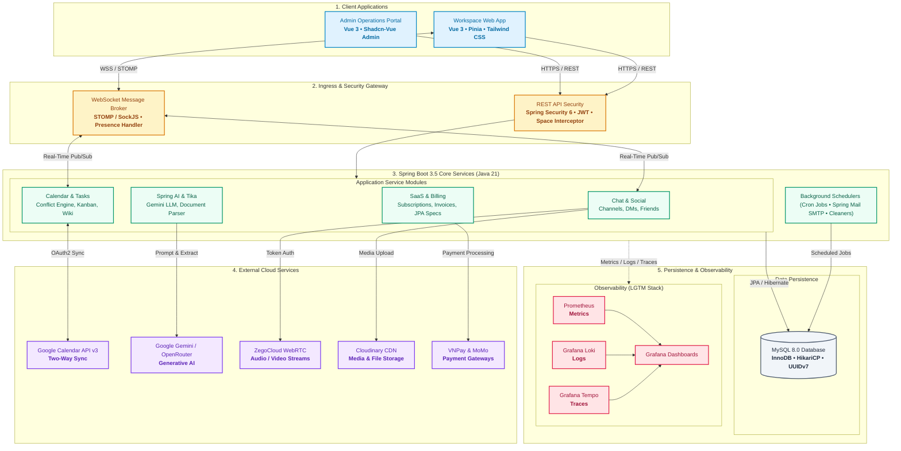

<div align="center">
  <a href="https://synkork.id.vn">
    
  </a>

  <h3>Synkork</h3>

  <p>
    <strong>All-in-One Team Collaboration & Intelligent SaaS Workspace Platform</strong>
  </p>

  <p>
    <strong>English</strong> &bull;
    <a href="README.vi.md">Tiếng Việt</a> &bull;
    <a href="README.zh-CN.md">简体中文</a>
  </p>

  <p>
    <a href="https://synkork.id.vn">
      
    </a>
    
    
    
    
    
    
  </p>

  <p>
    <a href="https://synkork.id.vn">Live Website</a> &bull;
    <a href="#system-architecture">Architecture</a> &bull;
    <a href="#comprehensive-feature-suite">Platform Features</a> &bull;
    <a href="#technical-stack">Tech Stack</a> &bull;
    <a href="#getting-started">Getting Started</a> &bull;
    <a href="#observability--monitoring">Observability</a>
  </p>
</div>

<br />

<p align="center">
  
</p>

> [!NOTE]
> **Synkork** is a full-featured team collaboration and workspace management platform that unifies real-time communication (Discord-inspired text channels, direct messaging, and WebRTC voice/video calls) with enterprise productivity tools (Kanban task boards, shared wiki notes, two-way Google Calendar synchronization, AI meeting intelligence, payment integration, and a dedicated SaaS admin portal).

---

## Overview

Modern teams often suffer from tool fragmentation—switching between Discord/Slack for chats, Zoom for calls, Google Calendar for schedules, Trello for tasks, and Notion for documentation.

**Synkork** solves this friction by consolidating all essential team workflows into a single cohesive platform. Built with an enterprise-grade **Spring Boot 3** backend and responsive **Vue 3** client applications, Synkork delivers low-latency collaboration, robust access control, automated third-party integrations, and end-to-end operational observability.

---

## System Architecture



---

## Comprehensive Feature Suite

### 1. Spaces, Rooms & Access Control
* **Discord-Style Workspace Hierarchy**: Organize collaboration around customizable **Spaces**, partitioned into topic-based text channels and audio/video rooms.
* **Granular Role-Based Permissions**: Full control over member roles, authority delegations, chat mute durations, kicks, and bans to maintain community standards.

### 2. Real-Time Messaging, Social & Direct Chats
* **Sub-Second WebSocket Delivery**: Real-time communication via **STOMP over SockJS**, complete with message threading, replies, reactions, and live typing indicators.
* **Direct Messages & Social Networking**: 1-on-1 private messaging, friend request lifecycles (send, accept, decline), and live online/offline presence detection.
* **Notification Hub**: In-app notification center for mentions, invitations, task assignments, and calendar event alerts.

### 3. High-Quality WebRTC Voice & Video Conferencing
* **Embedded Room Conferencing**: Integrated **ZegoCloud WebRTC SDK** with secure backend token generation for instant group audio and video calls directly inside workspace channels.
* **Screen Sharing & Collaboration**: Built-in screen sharing for presentations, pair debugging, and team standups.

### 4. Agile Kanban Boards & Task Management
* **Visual Workboards**: Drag-and-drop Kanban workflow with customizable status lanes (To Do, In Progress, Review, Done).
* **Detailed Task Cards**: Assign multiple team members, set due dates, configure priorities, and categorize with custom color-coded labels.

### 5. Collaborative Team Wiki & Notes
* **Centralized Knowledge Base**: Rich-text and markdown documentation editor designed for engineering specs, runbooks, and meeting minutes.
* **Version History**: Track document revisions and maintain historical versions of team notes.

### 6. Intelligent Scheduling & Two-Way Google Calendar Sync
* **Multi-View Calendar**: Seamlessly switch between Month, Week, and Day views with automated recurring event calculations.
* **Algorithmic Conflict Detection**: Prevents double-booking and schedule collisions across team members.
* **Bi-Directional Google Calendar Sync**: Connects with **Google Calendar API v3** via OAuth2 token lifecycle management to sync events between Synkork and personal calendars.
* **Chat NLP Suggestion Engine**: Analyzes conversation context in channels to automatically suggest and create calendar events with a single click.

### 7. AI Meeting Intelligence & Document Extraction
* **Spring AI & Generative Summaries**: Integrated **Google Gemini GenAI** to extract meeting transcripts, synthesize discussions, and generate actionable task lists.
* **Document Parsing Engine**: Leverages **Apache Tika** (core and standard parsers) to extract text from `.pdf`, `.docx`, and `.xlsx` uploads for context-aware summaries.

### 8. SaaS Billing & Payment Integration
* **Flexible Pricing Tiers**: Multi-plan subscription architecture (Free, Pro, Enterprise) with feature-gate enforcement.
* **Integrated Payment Gateways**: Production-ready support for **VNPay** and **MoMo**, accompanied by automated billing cycle management, invoice generation, and reminder emails via Spring Mail.

### 9. Dedicated SaaS Admin Portal (`portal-admin`)
* **Real-Time Operations Dashboard**: Monitor active spaces, registered users, platform revenue, and real-time system metrics.
* **Audit Logs & Moderation**: Dynamic **JPA Specifications** for multi-criteria querying across system audit trails, user report tickets, and password reset requests.

### 10. Production-Grade Observability (LGTM Stack)
* **Metrics**: Real-time JVM and application metrics exposed via Spring Boot Actuator and scraped into **Prometheus**.
* **Centralized Logging**: Structured JSON logging piped directly to **Grafana Loki** using `loki-logback-appender`.
* **Distributed Tracing**: End-to-end request tracing instrumented via Brave and Zipkin, exported into **Grafana Tempo**.

---

## Technical Stack

| Domain | Technologies & Libraries |
|---|---|
| **Backend Framework** | Java 21, Spring Boot 3.5.9, Spring MVC, Spring Data JPA (Hibernate), Spring Validation |
| **Security & Identity** | Spring Security 6, OAuth2 Client, OAuth2 Resource Server, JJWT 0.12.6, BCrypt |
| **Real-Time & Media** | Spring WebSocket (STOMP), SockJS, ZegoCloud WebRTC SDK, Cloudinary CDN |
| **Artificial Intelligence** | Spring AI, Google GenAI SDK (Gemini), Apache Tika 2.9.2 |
| **Payments** | VNPay SDK, MoMo API, Spring Mail, Spring Task Scheduler |
| **Primary Client App** | Vue 3.5 (Composition API, `<script setup>`), Vite, Pinia, Vue Router, Tailwind CSS, Lucide Icons |
| **Admin Management App** | Vue 3, Shadcn-Vue Admin, Radix Vue / Reka UI, Tailwind CSS, pnpm |
| **Database & Persistence** | MySQL 8.0, Hibernate ORM, Dynamic JPA Specifications |
| **DevOps & Observability** | Docker, Docker Compose, Micrometer, Prometheus, Grafana Loki, Grafana Tempo |
| **API Documentation** | Springdoc OpenAPI 2.8.x (Swagger UI) |

---

## Monorepo Structure

```text
Synkork/
├── backend/                # Spring Boot 3 microservice backend
│   ├── docker/             # Observability configs (Prometheus, Grafana, Loki, Tempo)
│   ├── src/main/java/      # Business logic, REST controllers, WebSocket & JPA specs
│   └── pom.xml             # Java 21 & Maven dependency definitions
├── frontend/               # Primary Vue 3 user workspace client
│   ├── src/                # Channel chat, Calendar, Kanban boards, WebRTC calls
│   └── package.json        # Frontend dependencies (Pinia, Tailwind CSS, ZegoCloud)
├── portal-admin/           # Enterprise SaaS management & administration portal
│   ├── src/                # Subscription management, revenue analytics, audit logs
│   └── package.json        # Admin dependencies (Shadcn-Vue, pnpm)
└── assets/                 # Brand assets, logos, and UI screenshots
```

---

## Getting Started

### Prerequisites
* **Java Development Kit (JDK) 21**
* **Node.js (v20+ or v22 LTS)**
* **pnpm** (`npm install -g pnpm`)
* **MySQL 8.0+**
* **Docker & Docker Compose** (optional, for observability stack)

### 1. Clone Repository
```sh
git clone https://github.com/DevHieu/Synkork.git
cd Synkork
```

### 2. Backend Setup
```sh
cd backend
# Copy environment configuration
cp .env.example .env

# Run database migrations and start Spring Boot
./mvnw spring-boot:run
```
> [!TIP]
> Swagger API documentation will be available at: `http://localhost:8080/swagger-ui.html`

### 3. Frontend Client Setup
```sh
cd ../frontend
npm install
npm run dev
```
Client runs at `http://localhost:5173`.

### 4. Admin Portal Setup
```sh
cd ../portal-admin
pnpm install
pnpm dev
```
Admin portal runs at `http://localhost:5174`.

### 5. Running Observability (Optional)
```sh
cd ../backend
docker-compose -f docker-compose.yml up -d
```
Access Prometheus at `:9090`, Grafana at `:3000`, and Tempo at `:3200`.

---

## Observability & Monitoring

Synkork exposes production-grade telemetry:
* **Metrics**: `/actuator/prometheus` scraped into Prometheus.
* **Logs**: Structured JSON logs shipped to Loki via Logback.
* **Traces**: Distributed trace propagation via Brave and Zipkin into Tempo.

---

## Core Team & Contributors

<div align="center">
  <p>Synkork is developed as a Capstone Graduation Project by the engineering team at FPT POLYTECHNIC COLLEGE (FPL):</p>
  <a href="https://github.com/DevHieu/Synkork/graphs/contributors">
    
  </a>
</div>

<br />

| Member | Role | GitHub / Contact |
|---|---|---|
| **Bùi Minh Hiếu** | Team Lead / Full-Stack Engineer | [@DevHieu](https://github.com/DevHieu) &bull; [Email](mailto:hieudd2090@gmail.com) |
| **Nguyễn Thái Học** | Backend & AI Engineer | [@ngthaihoc](https://github.com/ngthaihoc) &bull; [Email](mailto:ngthaihoc.vn@gmail.com) |
| **Nguyễn Thúy Vy** | Frontend & Admin Portal Engineer | [@thuyvy247](https://github.com/thuyvy247) &bull; [Email](mailto:thuyvy25012006@gmail.com) |
| **Phương Trâm** | Frontend / UI-UX Engineer | [@phuongtram300606](https://github.com/phuongtram300606) &bull; [Email](mailto:phuongtram300606@gmail.com) |

---

## Contact & Links

* **Repository**: [https://github.com/DevHieu/Synkork](https://github.com/DevHieu/Synkork)
* **Live Deployment**: [https://synkork.id.vn](https://synkork.id.vn)
* **Project Issue Tracker**: [https://github.com/DevHieu/Synkork/issues](https://github.com/DevHieu/Synkork/issues)
