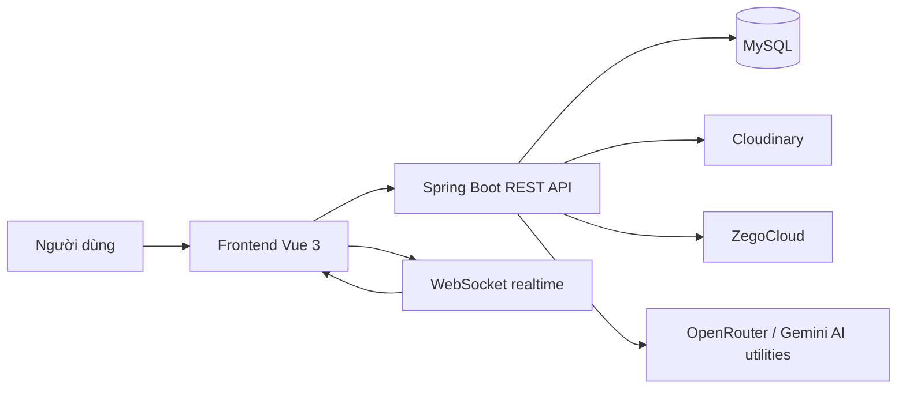

# Synkork Workspace

<p align="center">
  <strong>Repo cá nhân cho nền tảng cộng tác nhóm thời gian thực, tập trung vào giao tiếp, lịch làm việc và các luồng hỗ trợ bởi AI.</strong>
</p>

<p align="center">
  <a href="./README.md">Root</a>
  ·
  <a href="./README.en.md">English</a>
  ·
  <a href="./README.zh-CN.md">中文</a>
</p>

## 1. Tổng quan

Synkork là một nền tảng cộng tác nhóm theo mô hình room/space, lấy cảm hứng từ cách tổ chức của Discord nhưng hướng nhiều hơn tới nhu cầu làm việc nhóm. Hệ thống gom các nhu cầu cộng tác phổ biến vào cùng một workspace:

- Chat realtime
- Video call nhóm
- Quản lý task
- Ghi chú chung
- Lịch làm việc dùng chung
- Các luồng AI hỗ trợ tạo sự kiện và tóm tắt nội dung họp

Repo này là bản làm việc cá nhân của tôi, được tách ra từ dự án nhóm để phục vụ hai mục tiêu:

- Trình bày lại hệ thống dưới góc nhìn kỹ thuật rõ ràng hơn
- Nhấn mạnh các phần tôi tập trung triển khai: `calendar` và `llm function`

## 2. Định vị của repo này

Đây không phải README kiểu template. Tôi dùng repo này như một bản curated workspace:

- Giữ nguyên ngữ cảnh của dự án tổng thể
- Làm rõ kiến trúc, stack, và cách các module giao tiếp với nhau
- Trình bày sâu hơn phần tôi sở hữu hoặc tập trung mở rộng

Nói ngắn gọn: đây là bản repo cá nhân để người đọc vừa hiểu toàn hệ thống, vừa nhìn rõ phần năng lực kỹ thuật cốt lõi của tôi.

## 3. Kiến trúc cấp cao



### Thành phần chính

- `frontend/`: ứng dụng người dùng chính, viết bằng Vue 3 + Vite
- `backend/`: Spring Boot 3.5, xử lý API, bảo mật, realtime, nghiệp vụ cộng tác
- `portal-admin/`: cổng quản trị theo hướng dashboard, hiện đang dựa trên `shadcn-vue-admin`
- `database/`: tài nguyên dữ liệu và phần hỗ trợ schema
- `llm/`: tài liệu, guide, và ghi chú liên quan đến AI / refactor calendar

## 4. Tech stack

### Backend

- Java 21
- Spring Boot 3.5.9
- Spring Security
- Spring OAuth2 Client / Resource Server
- Spring WebSocket
- Spring Data JPA
- MySQL
- Cloudinary
- JWT
- Google OAuth2
- Google GenAI dependency và cấu hình Gemini trong `application.yml`

### Frontend

- Vue 3
- Vite
- TypeScript
- Pinia
- Tailwind CSS 4
- `dayjs`
- WebSocket / STOMP / Socket-related clients
- Zego WebRTC SDK

### Admin portal

- Vue 3
- Vite
- TypeScript
- shadcn-vue ecosystem
- pnpm workflow

### AI / LLM

- OpenRouter chat completions cho event extraction và meeting summary
- Cấu hình `spring.ai.gemini.api-key` trong backend để mở đường cho mở rộng AI services

## 5. Cấu trúc repo

```text
Synkork/
├── backend/
├── frontend/
├── portal-admin/
├── database/
├── llm/
├── ARCHITECTURE.md
└── README*.md
```

## 6. Điểm nhấn phần tôi tập trung triển khai

### 6.1. Calendar module

Calendar trong repo này không chỉ là giao diện lịch đơn thuần. Nó là một module cộng tác có đủ các phần:

- CRUD sự kiện theo `space`
- Lấy sự kiện theo ngày hoặc theo khoảng thời gian
- Hỗ trợ `recurrenceType`: `NONE`, `DAILY`, `WEEKLY`, `MONTHLY`, `YEARLY`
- Mở rộng sự kiện lặp ở backend theo range request
- Kiểm tra trùng giờ trước khi lưu
- Quyền chỉnh sửa theo người tạo hoặc `allowEditAll`
- Đồng bộ realtime qua WebSocket topic theo từng calendar space
- Form có chuẩn bị cho attendees và attachments
- Cầu nối từ chat suggestion sang calendar draft
- Hỗ trợ nhiều cách nhìn lịch: month, week, year

### 6.2. LLM functions

Nhóm chức năng LLM hiện tại tập trung vào hai hướng:

1. Hiểu nội dung chat để gợi ý tạo lịch
2. Xử lý voice meeting để chuyển giọng nói thành văn bản và tóm tắt

Các điểm chính:

- `llmService.java` gửi prompt tới OpenRouter để nhận diện sự kiện trong tin nhắn tiếng Việt
- Kết quả trả về theo JSON có cấu trúc để frontend dựng draft
- `calendarSuggestion.ts` ở frontend chuẩn hóa thời gian, fallback giờ bắt đầu/kết thúc và tạo draft dùng ngay cho form calendar
- `llmMeetingService.java` xử lý:
  - audio transcription
  - meeting summary JSON
- `llmServiceVoice.java` nối pipeline upload file, transcription và summarize trong một endpoint

## 7. Calendar: implementation flow

### Luồng dữ liệu chính

1. Người dùng thao tác ở `CalendarWindowLayout.vue`
2. `useCalendar()` điều phối:
   - state ngày tháng
   - CRUD event
   - realtime sync
3. Frontend gọi `calendarService.ts`
4. Backend nhận request qua `CalendarEventController`
5. `CalendarEventService` xử lý nghiệp vụ
6. Dữ liệu được lưu qua `CalendarEventRepository`
7. Sau create/update/delete, backend broadcast realtime tới:
   - `/topic/space/{spaceId}/calendar`
8. Frontend subscribe qua `useCalendarRealtime.ts` để cập nhật event list tại chỗ

### Quyết định kỹ thuật nổi bật

- Recurring events được expand ở backend thay vì để frontend tự tính hoàn toàn
  Lý do: giữ logic nhất quán, tránh lặp thuật toán ở nhiều view.

- Conflict detection chạy trên tập sự kiện của đúng ngày, bao gồm cả event lặp
  Lý do: người dùng nhìn thấy xung đột thực tế chứ không chỉ xung đột của bản ghi gốc.

- Permission model đơn giản và rõ:
  - creator được sửa/xóa
  - người khác chỉ sửa được nếu `allowEditAll = true`

- Realtime sync dùng channel theo `space`
  Lý do: scope nhỏ, dễ tách theo từng lịch của từng room.

### Các file quan trọng

- `backend/src/main/java/com/synkork/backend/modules/collaboration/calendar/controller/CalendarEventController.java`
- `backend/src/main/java/com/synkork/backend/modules/collaboration/calendar/service/CalendarEventService.java`
- `backend/src/main/java/com/synkork/backend/modules/collaboration/calendar/dto/CalendarEventDTO.java`
- `frontend/src/components/windows/CalendarWindowLayout.vue`
- `frontend/src/components/calendar/composables/useCalendar.ts`
- `frontend/src/components/calendar/composables/useCalendarRealtime.ts`
- `frontend/src/services/calendarService.ts`

## 8. LLM: implementation flow

### 8.1. Chat to calendar suggestion

1. Tin nhắn chat được gửi lên backend
2. Backend có thể gọi `llmService.detectEventFromMessage(...)`
3. Prompt yêu cầu model trích xuất event bằng tiếng Việt dưới dạng JSON
4. Frontend nhận suggestion payload
5. `calendarSuggestionStore.ts` giữ state cầu nối tạm
6. `CalendarSuggestionChannelDialog.vue` cho người dùng chọn calendar channel phù hợp
7. `calendarSuggestion.ts` chuẩn hóa:
   - ngày
   - giờ bắt đầu
   - giờ kết thúc
   - fallback logic
8. Calendar dialog mở sẵn draft để người dùng xác nhận và lưu

### 8.2. Voice meeting to summary

1. Frontend upload file voice
2. `llmServiceVoice` nhận file và metadata
3. File được upload qua `FileService` lên Cloudinary
4. `llmMeetingService.transcribeAudio(...)` gọi model để chuyển giọng nói thành text
5. `llmMeetingService.summarizeMeeting(...)` tạo JSON summary tiếng Việt
6. Backend trả về:
   - `fileUrl`
   - `publicId`
   - `transcript`
   - `analysis`

### Quyết định kỹ thuật nổi bật

- Dùng JSON output cho cả event extraction và meeting summary
  Lý do: frontend/backend dễ parse, dễ validate, và ít phụ thuộc vào output tự do.

- Tách `transcribeAudio` và `summarizeMeeting` thành 2 bước
  Lý do: dễ debug pipeline và có thể tái sử dụng transcript cho use case khác.

- Giữ một store trung gian cho suggestion từ chat sang lịch
  Lý do: tránh coupling cứng giữa UI chat và UI calendar.

### Các file quan trọng

- `backend/src/main/java/com/synkork/backend/common/utils/llmService.java`
- `backend/src/main/java/com/synkork/backend/common/utils/llmMeetingService.java`
- `backend/src/main/java/com/synkork/backend/common/utils/llmServiceVoice.java`
- `frontend/src/utils/calendarSuggestion.ts`
- `frontend/src/stores/calendarSuggestionStore.ts`
- `frontend/src/components/chat/sub-components/CalendarSuggestionChannelDialog.vue`

## 9. Chạy local

### Yêu cầu

- Java 21
- Node.js 22+
- MySQL
- npm cho `frontend`
- pnpm cho `portal-admin`

### Backend

```bash
cd backend
./mvnw spring-boot:run
```

Windows PowerShell:

```powershell
cd backend
.\mvnw.cmd spring-boot:run
```

### Frontend

```bash
cd frontend
npm install
npm run dev
```

### Admin portal

```bash
cd portal-admin
pnpm install
pnpm dev
```

## 10. Biến môi trường đáng chú ý

### Backend

Các biến xuất hiện trong code/config hiện tại:

- `DB_URL`
- `DB_USERNAME`
- `DB_PASSWORD`
- `GOOGLE_CLIENT_ID`
- `GOOGLE_CLIENT_SECRET`
- `GMAIL_USERNAME`
- `GMAIL_PASSWORD`
- `CLOUDINARY_CLOUD_NAME`
- `CLOUDINARY_API_KEY`
- `CLOUDINARY_API_SECRET`
- `ZEGO_APPID`
- `ZEGO_SERVER_SECRET`
- `GEMINI_API_KEY`
- `OPENROUTER_API_KEY`
- `OPENROUTER_BASE_URL`
- `FRONTEND_URL`
- `ADMIN_PORTAL_URL`

### Frontend

- `VITE_SERVER_API_URL`
- `VITE_SERVER_API_PREFIX`
- `VITE_SERVER_API_TIMEOUT`

## 11. Hướng phát triển tiếp

- Hoàn thiện persistence cho attendees và attachments ở calendar flow end-to-end
- Tăng validation và schema control cho AI output
- Bổ sung test cho recurrence, conflict detection và AI integration boundaries
- Chuẩn hóa thêm tài liệu deploy cho toàn workspace

## 12. Ghi chú minh bạch

- `portal-admin` hiện có dấu vết xuất phát từ `shadcn-vue-admin`; phần này cần được hiểu như nền dashboard được tùy biến vào workspace chung.
- `gh` CLI trong môi trường hiện tại chưa xác thực được GitHub API, nên README này được viết dựa trên mã nguồn local thay vì metadata live từ GitHub.
- Repo này xuất phát từ bối cảnh làm việc nhóm, nhưng phần README được biên soạn theo góc nhìn repo cá nhân và nhấn mạnh phần tôi tập trung kỹ thuật.
