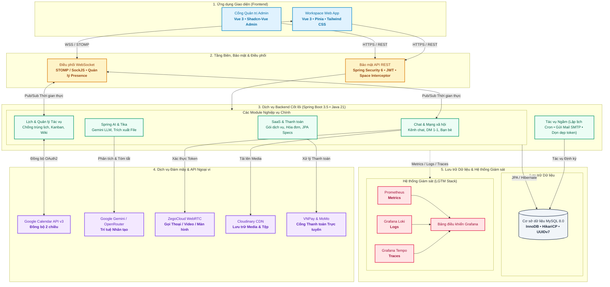

<div align="center">
  <a href="https://synkork.id.vn">
    
  </a>

  <h3>Synkork</h3>

  <p>
    <strong>Nền tảng Quản lý Công việc & Cộng tác Nhóm Thông minh Chuẩn SaaS</strong>
  </p>

  <p>
    <a href="README.md">English</a> &bull;
    <strong>Tiếng Việt</strong> &bull;
    <a href="README.zh-CN.md">简体中文</a>
  </p>

  <p>
    <a href="https://synkork.id.vn">
      
    </a>
    
    
    
    
    
    
  </p>

  <p>
    <a href="https://synkork.id.vn">Trang web trực tiếp</a> &bull;
    <a href="#kiến-trúc-hệ-thống">Kiến trúc</a> &bull;
    <a href="#tổng-quan-các-tính-năng-nền-tảng">Tính năng</a> &bull;
    <a href="#công-nghệ-sử-dụng">Tech Stack</a> &bull;
    <a href="#hướng-dẫn-cài-đặt">Cài đặt</a> &bull;
    <a href="#giám-sát--observability">Giám sát</a>
  </p>
</div>

<br />

<p align="center">
  
</p>

> [!NOTE]
> **Synkork** là nền tảng quản lý công việc và cộng tác nhóm toàn diện, kết hợp đồng bộ giữa giao tiếp thời gian thực (kênh chat phong cách Discord, nhắn tin trực tiếp, gọi thoại/video WebRTC) với các công cụ quản lý năng suất doanh nghiệp (bảng Kanban, wiki ghi chú nhóm, đồng bộ Google Calendar 2 chiều, trí tuệ nhân tạo AI tóm tắt cuộc họp, cổng thanh toán SaaS và trang quản trị hệ thống chuyên sâu).

---

## Giới thiệu tổng quan

Các đội ngũ hiện đại thường xuyên gặp tình trạng phân mảnh công cụ: trao đổi qua Discord/Slack, họp video bằng Zoom, sắp lịch trên Google Calendar, theo dõi tác vụ với Trello và viết tài liệu trên Notion.

**Synkork** giải quyết triệt để sự rời rạc này bằng cách hợp nhất tất cả quy trình làm việc thiết yếu vào một nền tảng duy nhất. Ứng dụng được xây dựng trên nền tảng backend **Spring Boot 3** mạnh mẽ cùng giao diện **Vue 3** linh hoạt, mang lại tốc độ phản hồi tức thì, kiểm soát phân quyền chặt chẽ, tích hợp tự động dịch vụ bên thứ ba và hệ thống giám sát vận hành toàn diện.

---

## Kiến trúc hệ thống



---

## Tổng quan các Tính năng Nền tảng

### 1. Không gian làm việc (Spaces), Kênh & Phân quyền
* **Cấu trúc Không gian kiểu Discord**: Phân chia không gian làm việc thành các **Spaces** tùy chỉnh, tổ chức theo kênh văn bản chuyên đề và phòng đàm thoại âm thanh/video.
* **Hệ thống Phân quyền Chặt chẽ**: Quản lý chi tiết vai trò thành viên, phân quyền quản trị viên, đặt thời hạn cấm chat, kick hoặc ban thành viên vi phạm quy tắc nhóm.

### 2. Nhắn tin Thời gian thực, Kết bạn & Chat Trực tiếp
* **Truyền tải WebSocket Dưới 1 Giây**: Nhắn tin tức thì qua **STOMP trên nền SockJS**, hỗ trợ chuỗi phản hồi (threads), reply, reaction cảm xúc và chỉ báo đang nhập (typing indicator).
* **Nhắn tin Riêng & Mạng xã hội Nội bộ**: Trò chuyện 1-1 riêng tư, quy trình kết bạn hoàn chỉnh (gửi, chấp nhận, từ chối) và phát hiện trạng thái online/offline theo thời gian thực.
* **Trung tâm Thông báo**: Hộp thư thông báo trong ứng dụng cho các lượt nhắc tên (@mention), lời mời tham gia, phân công công việc và nhắc lịch sự kiện.

### 3. Hội nghị Thoại & Video WebRTC Chất lượng cao
* **Phòng Họp Trực tiếp trong Kênh**: Tích hợp SDK **ZegoCloud WebRTC** với cơ chế xác thực token bảo mật từ backend, cho phép gọi nhóm thoại/video trực tiếp mà không cần ứng dụng ngoài.
* **Chia sẻ Màn hình Trực quan**: Hỗ trợ trình chiếu màn hình phục vụ thuyết trình, debug dự án theo cặp và báo cáo tiến độ hàng ngày.

### 4. Quản lý Tác vụ Kanban Linh hoạt
* **Bảng Công việc Trực quan**: Quy trình Kanban kéo thả mượt mà với các cột trạng thái tùy chỉnh (Cần làm, Đang làm, Đánh giá, Hoàn thành).
* **Thẻ Tác vụ Chi tiết**: Giao việc cho nhiều thành viên, đặt hạn chót (due date), thiết lập mức độ ưu tiên và phân loại bằng nhãn màu.

### 5. Kho Tài liệu Wiki & Ghi chú Cộng tác
* **Cơ sở Tri thức Trung tâm**: Trình soạn thảo văn bản hỗ trợ Markdown và Rich-text, thiết kế chuyên biệt cho tài liệu kỹ thuật, quy trình vận hành và biên bản cuộc họp.
* **Lịch sử Phiên bản**: Lưu trữ lịch sử sửa đổi và xem lại các phiên bản trước đây của tài liệu.

### 6. Lịch Thông minh & Đồng bộ 2 chiều Google Calendar
* **Lịch Đa Chế độ Xem**: Chuyển đổi linh hoạt giữa các góc nhìn Tháng, Tuần, Ngày với thuật toán tự động tính toán sự kiện lặp lại.
* **Phát hiện Xung đột Lịch biểu**: Tự động phát hiện và cảnh báo các khung giờ bị trùng lịch của thành viên.
* **Đồng bộ 2 chiều Google Calendar**: Kết nối **Google Calendar API v3** qua luồng ủy quyền OAuth2, giữ lịch làm việc và lịch cá nhân luôn đồng nhất.
* **Nhận diện Sự kiện bằng NLP trong Chat**: Tự động phân tích nội dung cuộc trò chuyện để trích xuất thời gian và gợi ý tạo sự kiện chỉ với 1 cú click chuột.

### 7. Trí tuệ Nhân tạo Cuộc họp & Trích xuất File Đính kèm
* **Spring AI & Mô hình Ngôn ngữ Lớn**: Tích hợp **Google Gemini GenAI** để phân tích biên bản thoại, tóm tắt nội dung thảo luận và trích xuất danh sách hành động (action items).
* **Trích xuất Nội dung Tệp Tự động**: Tích hợp **Apache Tika** để đọc và trích xuất văn bản từ các tài liệu đính kèm (`.pdf`, `.docx`, `.xlsx`), làm dữ liệu ngữ cảnh cho AI.

### 8. Thanh toán & Gói Thuê bao SaaS
* **Đa dạng Gói Dịch vụ**: Cấu trúc phân hạng dịch vụ (Miễn phí, Nâng cao, Doanh nghiệp) với cơ chế kiểm soát giới hạn tài nguyên.
* **Tích hợp Cổng Thanh toán**: Hỗ trợ thanh toán trực tuyến qua **VNPay** và **MoMo**, tự động quản lý chu kỳ thuê bao, xuất hóa đơn và gửi email nhắc nhở qua Spring Mail.

### 9. Cổng Quản trị Vận hành Độc lập (`portal-admin`)
* **Bảng Thống kê Trực quan**: Theo dõi thời gian thực số lượng spaces hoạt động, tài khoản người dùng, biểu đồ doanh thu và tài nguyên hệ thống.
* **Nhật ký Kiểm toán & Xử lý Khiếu nại**: Sử dụng **JPA Specifications** lọc động đa điều kiện đối với nhật ký hệ thống (audit logs), báo cáo vi phạm nội dung và yêu cầu đổi mật khẩu.

### 10. Hệ thống Giám sát Chuẩn Doanh nghiệp (Observability)
* **Metrics**: Thu thập thông số hiệu năng ứng dụng qua Spring Boot Actuator vào **Prometheus**.
* **Logs**: Thu thập và quản lý log định dạng JSON tập trung vào **Grafana Loki** qua `loki-logback-appender`.
* **Traces**: Phân tán vết gọi hàm xuyên suốt hệ thống bằng Brave và Zipkin, phân tích tại **Grafana Tempo**.

---

## Công nghệ sử dụng

| Lĩnh vực | Công nghệ & Thư viện |
|---|---|
| **Backend Framework** | Java 21, Spring Boot 3.5.9, Spring MVC, Spring Data JPA (Hibernate), Spring Validation |
| **Bảo mật & Định danh** | Spring Security 6, OAuth2 Client, OAuth2 Resource Server, JJWT 0.12.6, BCrypt |
| **Thời gian thực & Media** | Spring WebSocket (STOMP), SockJS, ZegoCloud WebRTC SDK, Cloudinary CDN |
| **Trí tuệ Nhân tạo (AI)** | Spring AI, Google GenAI SDK (Gemini), Apache Tika 2.9.2 |
| **Thanh toán & Email** | VNPay SDK, MoMo API, Spring Mail, Spring Task Scheduler |
| **Ứng dụng Người dùng** | Vue 3.5 (Composition API, `<script setup>`), Vite, Pinia, Vue Router, Tailwind CSS, Lucide Icons |
| **Cổng Quản trị Admin** | Vue 3, Shadcn-Vue Admin, Radix Vue / Reka UI, Tailwind CSS, pnpm |
| **Cơ sở Dữ liệu & ORM** | MySQL 8.0, Hibernate ORM, Dynamic JPA Specifications |
| **Vận hành & Giám sát** | Docker, Docker Compose, Micrometer, Prometheus, Grafana Loki, Grafana Tempo |
| **Tài liệu API** | Springdoc OpenAPI 2.8.x (Swagger UI) |

---

## Cấu trúc Dự án

```text
Synkork/
├── backend/                # Dịch vụ backend Spring Boot 3
│   ├── docker/             # Cấu hình giám sát (Prometheus, Grafana, Loki, Tempo)
│   ├── src/main/java/      # Mã nguồn nghiệp vụ, Controller, WebSocket & JPA Specs
│   └── pom.xml             # Khai báo thư viện & cấu hình Java 21
├── frontend/               # Giao diện không gian làm việc chính cho người dùng
│   ├── src/                # Module chat, lịch, bảng Kanban, gọi video WebRTC
│   └── package.json        # Thư viện phụ thuộc (Pinia, Tailwind CSS, ZegoCloud)
├── portal-admin/           # Cổng điều hành & quản lý SaaS cho quản trị viên
│   ├── src/                # Quản lý gói đăng ký, báo cáo doanh thu, audit logs
│   └── package.json        # Thư viện quản trị (Shadcn-Vue, pnpm)
└── assets/                 # Hình ảnh logo thương hiệu và ảnh chụp màn hình UI
```

---

## Hướng dẫn cài đặt

### Yêu cầu môi trường
* **Java Development Kit (JDK) 21**
* **Node.js (phiên bản v20+ hoặc v22 LTS)**
* **pnpm** (`npm install -g pnpm`)
* **MySQL 8.0+**
* **Docker & Docker Compose** (tùy chọn, để chạy cụm giám sát)

### 1. Sao chép mã nguồn
```sh
git clone https://github.com/DevHieu/Synkork.git
cd Synkork
```

### 2. Khởi chạy Backend
```sh
cd backend
# Tạo file cấu hình môi trường từ mẫu
cp .env.example .env

# Chạy ứng dụng Spring Boot
./mvnw spring-boot:run
```
> [!TIP]
> Tài liệu Swagger UI sẽ mở tại địa chỉ: `http://localhost:8080/swagger-ui.html`

### 3. Khởi chạy Giao diện Người dùng
```sh
cd ../frontend
npm install
npm run dev
```
Truy cập tại: `http://localhost:5173`.

### 4. Khởi chạy Cổng Quản trị Admin
```sh
cd ../portal-admin
pnpm install
pnpm dev
```
Truy cập tại: `http://localhost:5174`.

### 5. Khởi động Cụm Giám sát (Tùy chọn)
```sh
cd ../backend
docker-compose -f docker-compose.yml up -d
```
Xem Prometheus tại cổng `:9090`, Grafana tại `:3000` và Tempo tại `:3200`.

---

## Giám sát & Observability

Hệ thống cung cấp các điểm cuối phục vụ theo dõi vận hành:
* **Metrics**: Cung cấp qua `/actuator/prometheus` cho Prometheus thu thập.
* **Logs**: Gửi log định dạng JSON có cấu trúc về Loki qua Logback appender.
* **Traces**: Phân tán vết gọi hàm qua Brave & Zipkin đưa vào Tempo.

---

## Đội ngũ Phát triển & Đóng góp

<div align="center">
  <p>Dự án tốt nghiệp được thực hiện bởi nhóm sinh viên Cao đẳng FPT POLYTECHNIC (FPL):</p>
  <a href="https://github.com/DevHieu/Synkork/graphs/contributors">
    
  </a>
</div>

<br />

| Thành viên | Vai trò | GitHub / Liên hệ |
|---|---|---|
| **Bùi Minh Hiếu** | Trưởng nhóm / Kỹ sư Full-Stack | [@DevHieu](https://github.com/DevHieu) &bull; [Email](mailto:hieudd2090@gmail.com) |
| **Nguyễn Thái Học** | Kỹ sư Backend & AI | [@ngthaihoc](https://github.com/ngthaihoc) &bull; [Email](mailto:ngthaihoc.vn@gmail.com) |
| **Nguyễn Thúy Vy** | Kỹ sư Frontend & Admin Portal | [@thuyvy247](https://github.com/thuyvy247) &bull; [Email](mailto:thuyvy25012006@gmail.com) |
| **Phương Trâm** | Kỹ sư Frontend / UI-UX | [@phuongtram300606](https://github.com/phuongtram300606) &bull; [Email](mailto:phuongtram300606@gmail.com) |

---

## Liên kết & Thông tin Liên hệ

* **Kho mã nguồn**: [https://github.com/DevHieu/Synkork](https://github.com/DevHieu/Synkork)
* **Website Trực tiếp**: [https://synkork.id.vn](https://synkork.id.vn)
* **Báo cáo lỗi & Đề xuất**: [https://github.com/DevHieu/Synkork/issues](https://github.com/DevHieu/Synkork/issues)
