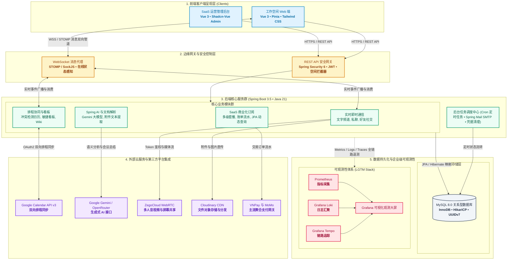

<div align="center">
  <a href="https://synkork.id.vn">
    
  </a>

  <h3>Synkork</h3>

  <p>
    <strong>一体化团队实时协作与智能 SaaS 工作空间平台</strong>
  </p>

  <p>
    <a href="README.md">English</a> &bull;
    <a href="README.vi.md">Tiếng Việt</a> &bull;
    <strong>简体中文</strong>
  </p>

  <p>
    <a href="https://synkork.id.vn">
      
    </a>
    
    
    
    
    
    
  </p>

  <p>
    <a href="https://synkork.id.vn">在线演示</a> &bull;
    <a href="#系统架构">系统架构</a> &bull;
    <a href="#全功能特性体系">功能特性</a> &bull;
    <a href="#技术栈">技术栈</a> &bull;
    <a href="#快速上手">快速上手</a> &bull;
    <a href="#可观测性与监控">可观测性</a>
  </p>
</div>

<br />

<p align="center">
  
</p>

> [!NOTE]
> **Synkork** 是一个全功能的团队实时协作与工作空间管理平台，将实时即时通讯（Discord 风格文字频道、私聊、WebRTC 语音与视频通话）与企业生产力工具（敏捷看板、知识库 Wiki、双向 Google 日历同步、AI 智能会议提炼、在线支付以及独立运营管理后台）深度整合于统一的云原生架构中。

---

## 项目概述

现代知识型与研发团队经常受困于工具链碎片化：日常交流在 Discord/Slack、视频开会用 Zoom、日程排期用 Google Calendar、任务跟进在 Trello、知识沉淀在 Notion。

**Synkork** 旨在消除这种割裂感，将核心协作场景收敛于统一的工作空间中。系统采用成熟稳定的 **Spring Boot 3** 微服务架构作为后端支撑，前端采用响应式 **Vue 3** 客户端，具备高并发消息推送、细粒度权限控制、自动化外部 API 联动与企业级全链路可观测性。

---

## 系统架构



---

## 全功能特性体系

### 1. 工作空间 (Spaces)、频道与权限管控
* **Discord 风格空间层级**：支持创建多个定制化 **Spaces**，划分针对特定主题的文字讨论频道与多人语音/视频房间。
* **精细化角色与权限模型**：支持成员角色分配、管理员授权、禁言时长设置、踢出与封禁等完善的社区与团队治理机制。

### 2. 实时即时通讯、好友社交与私信
* **亚秒级 WebSocket 消息推送**：基于 **STOMP over SockJS** 实现，支持消息楼层回复（thread）、表情反应（reaction）与实时正在输入提示。
* **私聊与好友社交体系**：支持 1 对 1 点对点私信、好友申请闭环（发送、同意、拒绝）与在线/离线状态实时探测。
* **消息通知中心**：集中展示艾特提及 (@mention)、空间邀请、任务指派与日程临近提醒。

### 3. 高清低延迟 WebRTC 语音与视频会议
* **内嵌式多人音视频会议**：集成 **ZegoCloud WebRTC SDK** 与服务端 Token 鉴权，支持在频道内一键开启低延迟语音与视频会议。
* **屏幕共享协作**：支持桌面或指定应用窗口实时共享，方便远程代码评审、产品演示与日常站会。

### 4. 敏捷看板与项目任务管理
* **可视化工作流**：支持平滑拖拽的看板系统，自由定义任务列状态（待办、进行中、评审、已完成）。
* **丰富任务属性**：支持指派多位团队负责人、设定截止日期、优先级标记与自定义颜色标签。

### 5. 团队协同 Wiki 与笔记知识库
* **中心化文档知识库**：内置支持 Markdown 与富文本的编辑器，适用于团队技术规范、操作手册与会议纪要。
* **版本历史追踪**：记录文档历史修改版本，方便随时追溯与比对变更。

### 6. 交互式智能日历与 Google Calendar 双向同步
* **多视图排程体验**：支持月、周、日全功能视图切换，内置周期性循环事件自动展开计算算法。
* **智能冲突检测**：自动侦测跨团队成员的时间撞期冲突并提前预警。
* **Google 日历自动化双向同步**：集成 **Google Calendar API v3** 与 OAuth2 令牌生命周期管理，双向打通工作日程与外部个人日历。
* **聊天 NLP 智能日程感知**：实时语义解析频道消息上下文，自动提取时间实体并支持一键转化为正式日程。

### 7. AI 会议智能助手与文档结构化解析
* **Spring AI 与生成式大模型**：集成 **Google Gemini GenAI**，自动生成会议记录摘要、要点提炼与行动项建议（Action Items）。
* **非结构化文档内容解析**：搭载 **Apache Tika** 引擎，快速解析上传附件（`.pdf`, `.docx`, `.xlsx`）并提取正文作为大模型上下文。

### 8. SaaS 订阅计费与在线支付集成
* **灵活的多级套餐配置**：支持免费版、进阶版、企业版等多等级订阅方案与资源配额控制。
* **主流支付网关打通**：支持 **VNPay** 与 **MoMo** 在线支付，自动流转账单周期、生成电子账单并通过 Spring Mail 自动发送通知邮件。

### 9. 独立运营与系统管理后台 (`portal-admin`)
* **实时监控仪表盘**：全局掌控活跃空间数、注册用户趋势、平台营收走势与系统资源占用。
* **审计追踪与安全仲裁**：基于 **JPA Specifications** 实现动态多条件查询，统一管理系统审计日志、违规举报工单与重置密码请求。

### 10. 企业级全链路可观测性 (LGTM Stack)
* **指标监控 (Metrics)**：通过 Spring Boot Actuator 暴露核心指标，由 **Prometheus** 进行定期拉取。
* **集中日志 (Logs)**：采用 `loki-logback-appender` 统一收集结构化 JSON 日志并归集到 **Grafana Loki**。
* **链路追踪 (Traces)**：基于 Brave 与 Zipkin 采集全链路分布式 Trace，并在 **Grafana Tempo** 中进行可视化展示。

---

## 技术栈

| 领域 | 核心技术与组件 |
|---|---|
| **后端框架** | Java 21, Spring Boot 3.5.9, Spring MVC, Spring Data JPA (Hibernate), Spring Validation |
| **安全与认证** | Spring Security 6, OAuth2 Client, OAuth2 Resource Server, JJWT 0.12.6, BCrypt |
| **实时通信与流媒体** | Spring WebSocket (STOMP), SockJS, ZegoCloud WebRTC SDK, Cloudinary CDN |
| **人工智能与文档处理** | Spring AI, Google GenAI SDK (Gemini), Apache Tika 2.9.2 |
| **支付与通知** | VNPay SDK, MoMo API, Spring Mail, Spring Task Scheduler |
| **前端应用** | Vue 3.5 (Composition API, `<script setup>`), Vite, Pinia, Vue Router, Tailwind CSS, Lucide Icons |
| **后台管理应用** | Vue 3, Shadcn-Vue Admin, Radix Vue / Reka UI, Tailwind CSS, pnpm |
| **数据库与持久化** | MySQL 8.0, Hibernate ORM, Dynamic JPA Specifications |
| **运维监控与可观测性** | Docker, Docker Compose, Micrometer, Prometheus, Grafana Loki, Grafana Tempo |
| **接口文档** | Springdoc OpenAPI 2.8.x (Swagger UI) |

---

## 项目组织结构

```text
Synkork/
├── backend/                # Spring Boot 3 微服务后端
│   ├── docker/             # 可观测性监控配置 (Prometheus, Grafana, Loki, Tempo)
│   ├── src/main/java/      # 业务逻辑、控制器、WebSocket 与 JPA 规范
│   └── pom.xml             # Java 21 与 Maven 依赖管理
├── frontend/               # 用户工作空间前端客户端
│   ├── src/                # 频道聊天、日历、看板、WebRTC 通话组件
│   └── package.json        # 前端依赖配置 (Pinia, Tailwind CSS, ZegoCloud)
├── portal-admin/           # 运营与系统管理后台
│   ├── src/                # 租户订阅、营收报表分析与审计日志
│   └── package.json        # 后台管理依赖 (Shadcn-Vue, pnpm)
└── assets/                 # 品牌 Logo 与产品界面截图
```

---

## 快速上手

### 环境要求
* **Java Development Kit (JDK) 21**
* **Node.js (v20+ 或 v22 LTS)**
* **pnpm** (`npm install -g pnpm`)
* **MySQL 8.0+**
* **Docker & Docker Compose**（可选，用于启动监控全家桶）

### 1. 克隆代码仓库
```sh
git clone https://github.com/DevHieu/Synkork.git
cd Synkork
```

### 2. 启动后端服务
```sh
cd backend
# 复制环境变量配置文件模板
cp .env.example .env

# 执行数据库迁移并启动 Spring Boot 服务
./mvnw spring-boot:run
```
> [!TIP]
> 接口文档 (Swagger UI) 地址为：`http://localhost:8080/swagger-ui.html`

### 3. 启动前端客户端
```sh
cd ../frontend
npm install
npm run dev
```
访问地址：`http://localhost:5173`。

### 4. 启动管理后台
```sh
cd ../portal-admin
pnpm install
pnpm dev
```
访问地址：`http://localhost:5174`。

### 5. 启动可观测性监控套件 (可选)
```sh
cd ../backend
docker-compose -f docker-compose.yml up -d
```
Prometheus 端口 `:9090`，Grafana 端口 `:3000`，Tempo 端口 `:3200`。

---

## 可观测性与运维监控

Synkork 提供生产级可观测性支撑：
* **Metrics 指标**：通过 `/actuator/prometheus` 暴露指标并由 Prometheus 定期采集。
* **Logs 日志**：通过 Logback 将结构化 JSON 日志统一推送至 Loki。
* **Traces 链路**：借助 Brave / Zipkin 实现分布式请求链路追踪并上报至 Tempo。

---

## 核心团队与贡献者

<div align="center">
  <p>FPT POLYTECHNIC COLLEGE (FPL) 毕业设计团队倾力打造：</p>
  <a href="https://github.com/DevHieu/Synkork/graphs/contributors">
    
  </a>
</div>

<br />

| 成员 | 角色定位 | GitHub / 联系方式 |
|---|---|---|
| **Bùi Minh Hiếu** | 项目负责人 / 全栈工程师 | [@DevHieu](https://github.com/DevHieu) &bull; [Email](mailto:hieudd2090@gmail.com) |
| **Nguyễn Thái Học** | 后端与 AI 算法工程师 | [@ngthaihoc](https://github.com/ngthaihoc) &bull; [Email](mailto:ngthaihoc.vn@gmail.com) |
| **Nguyễn Thúy Vy** | 前端与后台工程师 | [@thuyvy247](https://github.com/thuyvy247) &bull; [Email](mailto:thuyvy25012006@gmail.com) |
| **Phương Trâm** | 前端 / UI-UX 工程师 | [@phuongtram300606](https://github.com/phuongtram300606) &bull; [Email](mailto:phuongtram300606@gmail.com) |

---

## 项目链接与联系

* **代码仓库**：[https://github.com/DevHieu/Synkork](https://github.com/DevHieu/Synkork)
* **在线演示系统**：[https://synkork.id.vn](https://synkork.id.vn)
* **问题反馈与建议**：[https://github.com/DevHieu/Synkork/issues](https://github.com/DevHieu/Synkork/issues)
