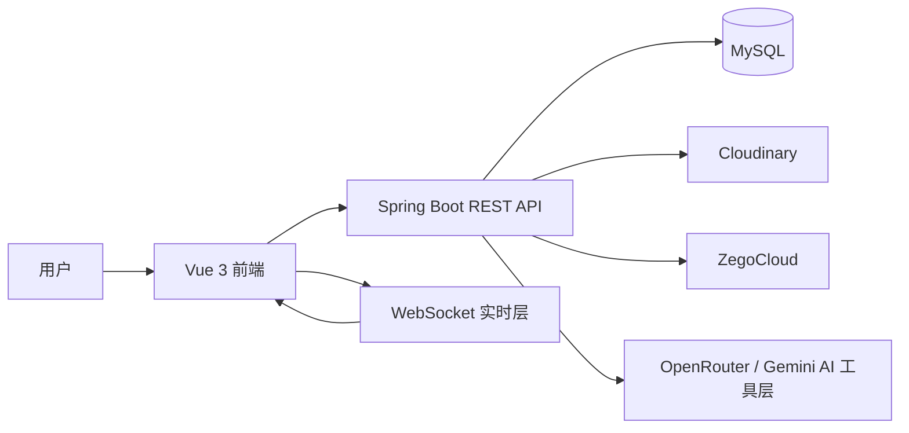

# Synkork Workspace

<p align="center">
  <strong>一个用于展示实时团队协作平台的个人仓库，重点包含日历协作与 AI 辅助工作流。</strong>
</p>

<p align="center">
  <a href="./README.md">Root</a>
  ·
  <a href="./README.vi.md">Tiếng Việt</a>
  ·
  <a href="./README.en.md">English</a>
</p>

## 1. 项目概览

Synkork 是一个基于 room / space 组织方式的协作平台，定位介于 Discord 风格工作区与办公协作系统之间。系统把多种常见协作能力集中到同一个 workspace 中：

- 实时聊天
- 群组通话
- 共享笔记
- 任务管理
- 共享日历
- AI 辅助的消息与会议处理流程

这个仓库是我从团队毕业项目中整理出来的个人版本，用于更清晰地展示系统结构以及我重点参与的技术模块。

## 2. 仓库定位

这不是一个单纯复制原团队代码的仓库，而是一个个人技术展示与持续迭代分支。

主要目标：

- 更清晰地说明整体架构
- 突出我重点负责或深入实现的模块
- 为后续个人扩展保留独立工作空间

当前重点展示方向：

- `calendar`
- `llm function`

## 3. 高层架构



仓库主要目录：

- `frontend/`：主用户端应用
- `backend/`：API、鉴权、实时通信、协作业务模块
- `portal-admin/`：后台管理界面
- `database/`：数据库相关资产
- `llm/`：AI 集成说明与日历/LLM 辅助文档

## 4. 技术栈

### 后端

- Java 21
- Spring Boot 3.5.9
- Spring Security
- OAuth2 Client / Resource Server
- Spring Data JPA
- Spring WebSocket
- MySQL
- JWT
- Cloudinary
- Google OAuth2
- Google GenAI 依赖与 Gemini 配置

### 前端

- Vue 3
- Vite
- TypeScript
- Pinia
- Tailwind CSS 4
- dayjs
- STOMP / socket 相关实时客户端
- Zego WebRTC SDK

### 管理端

- Vue 3
- Vite
- TypeScript
- 基于 shadcn-vue 的 dashboard 技术栈
- pnpm 工作流

### AI

- 基于 OpenRouter 的聊天补全流程
- 后端已保留 Gemini 配置，便于后续扩展

## 5. Calendar 模块亮点

这个仓库中的 calendar 不是简单的日期控件，而是一个真正的协作模块。

当前代码中可见的能力包括：

- 按 space 进行事件 CRUD
- 月 / 周 / 年视图
- 后端负责循环事件展开
- 时间冲突检测
- 带权限控制的事件编辑
- 基于 WebSocket topic 的实时同步
- 具备 attendees 与 attachments 的表单结构
- 从聊天建议到日历草稿的桥接流程

### Calendar 实现流程

1. 用户在 `CalendarWindowLayout.vue` 中操作
2. `useCalendar()` 统一协调日期状态、事件操作与实时逻辑
3. 前端通过 `calendarService.ts` 调用接口
4. `CalendarEventController` 暴露 REST API
5. `CalendarEventService` 处理业务逻辑
6. 通过 `CalendarEventRepository` 进行持久化
7. create / update / delete 后，后端广播到 `/topic/space/{spaceId}/calendar`
8. `useCalendarRealtime.ts` 在前端本地直接更新事件列表

### Calendar 技术决策

- 循环事件在后端展开，而不是完全交给前端
  原因：保证不同视图中的行为一致，减少重复逻辑。

- 冲突检测基于实际日期范围中的事件实例进行
  原因：包含循环事件后的真实冲突才对用户有意义。

- 权限模型保持简单清晰：
  - 创建者可以编辑和删除
  - 其他人只有在 `allowEditAll` 开启时才能编辑

- 实时通道按 `space` 进行隔离
  原因：同步范围小，易于维护。

关键文件：

- `backend/.../calendar/controller/CalendarEventController.java`
- `backend/.../calendar/service/CalendarEventService.java`
- `frontend/src/components/windows/CalendarWindowLayout.vue`
- `frontend/src/components/calendar/composables/useCalendarRealtime.ts`

## 6. LLM 功能亮点

当前仓库中的 LLM 相关实现主要围绕两个协作场景：

1. 从越南语聊天内容中提取事件建议
2. 对会议语音进行转写与摘要

### 聊天生成日历建议流程

1. 聊天消息可由 `llmService.detectEventFromMessage(...)` 分析
2. 后端把结构化 prompt 发送到 OpenRouter
3. 模型返回 JSON 格式的事件识别结果
4. 前端收到 suggestion payload
5. `calendarSuggestionStore.ts` 作为聊天与日历之间的临时桥接层
6. `CalendarSuggestionChannelDialog.vue` 让用户选择目标日历频道
7. `calendarSuggestion.ts` 负责时间和日期 fallback 标准化
8. 日历对话框直接以草稿形式打开供用户确认

### 会议语音摘要流程

1. 语音文件上传到 `/collaboration/voice-summary/upload`
2. `llmServiceVoice` 先通过 `FileService` 上传文件
3. `llmMeetingService.transcribeAudio(...)` 执行语音转文字
4. `llmMeetingService.summarizeMeeting(...)` 输出结构化越南语 JSON 摘要
5. 后端返回：
   - `fileUrl`
   - `publicId`
   - `transcript`
   - `analysis`

### LLM 技术决策

- 事件提取与会议摘要统一使用 JSON 输出
  原因：更容易解析、校验和前后端集成。

- 转写与摘要拆分为两个步骤
  原因：更容易调试，也方便后续复用 transcript。

- 使用轻量前端 store 连接聊天与日历
  原因：避免两个 UI 模块之间形成强耦合。

关键文件：

- `backend/src/main/java/com/synkork/backend/common/utils/llmService.java`
- `backend/src/main/java/com/synkork/backend/common/utils/llmMeetingService.java`
- `backend/src/main/java/com/synkork/backend/common/utils/llmServiceVoice.java`
- `frontend/src/utils/calendarSuggestion.ts`
- `frontend/src/stores/calendarSuggestionStore.ts`

## 7. 本地运行

要求：

- Java 21
- Node.js 22+
- MySQL
- `frontend` 使用 npm
- `portal-admin` 使用 pnpm

### Backend

```bash
cd backend
./mvnw spring-boot:run
```

### Frontend

```bash
cd frontend
npm install
npm run dev
```

### Admin Portal

```bash
cd portal-admin
pnpm install
pnpm dev
```

## 8. 环境变量

后端当前代码与配置中涉及的重要变量：

- `DB_URL`
- `DB_USERNAME`
- `DB_PASSWORD`
- `GOOGLE_CLIENT_ID`
- `GOOGLE_CLIENT_SECRET`
- `GMAIL_USERNAME`
- `GMAIL_PASSWORD`
- `CLOUDINARY_CLOUD_NAME`
- `CLOUDINARY_API_KEY`
- `CLOUDINARY_API_SECRET`
- `ZEGO_APPID`
- `ZEGO_SERVER_SECRET`
- `GEMINI_API_KEY`
- `OPENROUTER_API_KEY`
- `OPENROUTER_BASE_URL`
- `FRONTEND_URL`
- `ADMIN_PORTAL_URL`

前端示例变量：

- `VITE_SERVER_API_URL`
- `VITE_SERVER_API_PREFIX`
- `VITE_SERVER_API_TIMEOUT`

## 9. 后续方向

- 完成 calendar 中 attendees 与 attachments 的完整持久化链路
- 强化 AI 输出的验证边界
- 增加循环事件与冲突检测相关测试
- 继续完善部署与运行文档

## 10. 说明

- `portal-admin` 仍然保留了来自 `shadcn-vue-admin` 的定制化来源痕迹。
- 当前环境中的 `gh` CLI 没有可用认证，因此本文档是基于本地源码分析编写，而不是基于 GitHub 在线元数据。
- 仓库来源于团队项目，但文档表达方式有意采用个人技术展示的视角。
